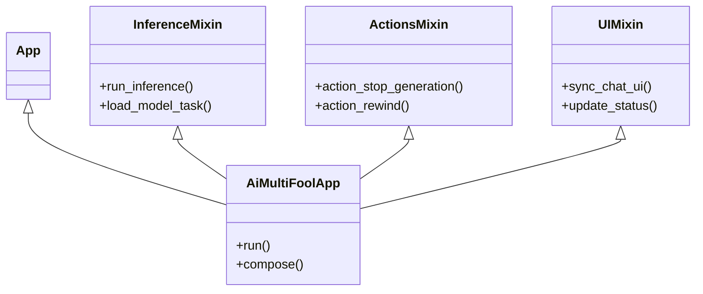

# System Reference Document: aiMultiFool v0.1.10

## 1. Executive Summary
aiMultiFool is a **hackable, modular, and privacy-centric** AI Roleplay Sandbox. It leverages **Textual** for a responsive, desktop-class TUI and **llama-cpp-python** for high-performance local inference. The architecture prioritizes separation of concerns via a Mixin pattern, enabling clean extensibility for theming, encryption, and complex character logic.

---

## 2. Technical Stack
| Component | Technology | Purpose |
| :--- | :--- | :--- |
| **Language** | Python 3.12+ | Core logic and type safety |
| **GUI Framework** | Textual | Reactive TUI with CSS styling |
| **Inference Engine** | llama-cpp-python | Python bindings for GGUF model execution |
| **Cryptography** | cryptography (Hazmat) | AES-256-GCM + Argon2id for file security |
| **Concurrency** | asyncio + Threads | Non-blocking UI input during blocking inference |
| **Data Format** | JSON / PNG (Chunked) | Metadata storage for Settings and Character Cards |

---

## 3. System Architecture
The application uses a **Mixin-based monolithic architecture** orchestrated by the main `App` class.

### 3.1 Class Hierarchy


### 3.2 Core Modules
- **`aimultifool.py`**: The entry point. Initializes the `App`, loads settings, and composes the primary layout.
- **`logic_mixins.py` (`InferenceMixin`, `ActionsMixin`)**:
    - **Inference**: usage of `@work(thread=True)` to offload blocking Llama.cpp calls to a background thread, preventing UI freeze. Uses `call_from_thread` to push updates back to the main event loop.
    - **State**: Manages the message history list, pruning logic, and token counting.
- **`ui_mixin.py` (`UIMixin`)**: Centralizes DOM manipulation. Handles the mounting of `MessageWidget`s and synchronizing the specific visual state with the backend `messages` list.
- **`styles.tcss`**: The primary stylesheet. Supports dynamic runtime modification (see **3.3 Theming**) via generic CSS variable overrides or string replacement.

### 3.3 Styling
The application uses Textual's CSS system with theme variables (`$primary`, `$accent`) for consistent styling across the interface.

---

## 4. AI & Inference Pipeline

### 4.1 Token Streaming
- **Iterative Decoding**: The `Llama.create_chat_completion` method is called with `stream=True`.
- **Text Assembly**: Chunks are yielded back to the main thread in real-time.
- **Visual Updates**: The `UIMixin` appends text to the active `MessageWidget` on every token, calculating TPS (Tokens Per Second) on the fly.

### 4.2 Context Management
- **Smart Pruning**: Before generation, the prompt is evaluated. If `total_tokens > context_size`, the system prunes the **middle** of the conversation history, preserving:
    1. The System Prompt (Index 0)
    2. The most recent `N` turns (User/Assistant pairs)
- **Caching**: The system caches successful GPU layer configurations in `model_cache.json` to speed up subsequent loads of the same model.

### 4.3 Character Cards (V2 Spec)
- **Format**: SillyTavern-compatible PNGs.
- **Metadata**: Embedded in standard `tEXt` chunks or base64-encoded `zTXt` chunks.
- **AI Editor**: The app can pipe extracted metadata back into a small LLM to "rewrite" or "enhance" the character description, streaming the result into the metadata editor fields.

---

## 5. Security & Cryptography

### 5.1 Encryption Standards
- **Algorithm**: AES-256-GCM (Galois/Counter Mode). Authenticated encryption ensures data integrity.
- **Key Derivation**: Argon2id.
    - *Memory Cost*: 64MB
    - *Iterations*: 3
    - *Salt*: Random 16 bytes per file
    - *Nonce*: Random 12 bytes per encryption
- **Scope**: Applied to Saved Chat files (`.json`) and Character Card metadata.

### 5.2 Local Persistence
- **No Cloud Sync**: All data is strictly local.
- **Passphrase Handling**: Passphrases are never stored; they are used strictly for transient key derivation and then discarded from memory.

---

## 6. Functional Data Models

### 6.1 `settings.json`
```json
{
    "user_name": "User",
    "context_size": 8196,
    "gpu_layers": 33,
    "selected_model": "/path/to/model.gguf",
    "style": "descriptive",
    "temp": 0.8,
    "topp": 0.9,
    "topk": 40,
    "minp": 0.05
}
```

### 6.2 Application State
- **Reactive Properties**: Textual's `reactive` logic creates a unidirectional data flow. Changing `self.is_loading` automatically toggles button states (Stop/Continue) across the entire UI tree without manual DOM queries.

---


