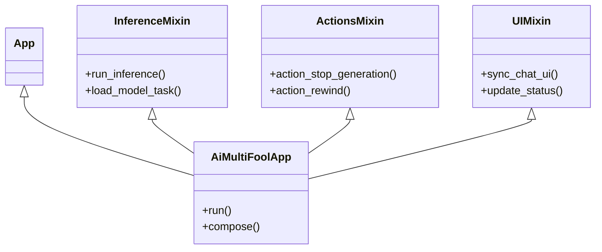

# System Reference Document: aiMultiFool v0.3.0

## 1. Executive Summary
aiMultiFool is a **hackable, modular, and privacy-centric** AI Roleplay Sandbox. It leverages **Textual** for a responsive, desktop-class TUI and supports dual inference modes: **llama-cpp-python** for high-performance local GPU inference and **Ollama API** for flexible model management. The architecture prioritizes separation of concerns via a Mixin pattern, enabling clean extensibility for theming, encryption, and complex character logic.

---

## 2. Technical Stack
| Component | Technology | Purpose |
| :--- | :--- | :--- |
| **Language** | Python 3.12+ | Core logic and type safety |
| **GUI Framework** | Textual | Reactive TUI with CSS styling |
| **Inference Engine (Local)** | llama-cpp-python | Python bindings for GGUF model execution |
| **Inference Engine (Ollama)** | Ollama API | HTTP API client for Ollama-managed models |
| **Cryptography** | cryptography (Hazmat) | AES-256-GCM + Argon2id for file security |
| **Vector DB** | Qdrant (Local) | Persistent long-term memory via embeddings |
| **Concurrency** | asyncio + Multi-threading | Non-blocking UI input via Textual @work (inference) and manual threading (loading) |
| **Data Format** | JSON / PNG (Chunked) | Metadata storage for Settings and Character Cards |

---

## 3. System Architecture
The application uses a **Mixin-based monolithic architecture** orchestrated by the main `App` class.

### 3.1 Class Hierarchy


### 3.2 Core Modules

#### Application Entry & Core Logic
- **`aimultifool.py`**: The entry point. Initializes the `App`, loads settings, and composes the primary layout. Sets Windows event loop policy for threading compatibility.

- **`logic_mixins.py` (`InferenceMixin`, `ActionsMixin`, `VectorMixin`)**:
    - **Inference**: Supports dual inference backends (local llama-cpp-python and Ollama API). Uses unified interface that works with both backends. To prevent GIL-related UI freezes, local model loading is handled via manual `threading.Thread` with a result `Queue`, while inference is orchestrated by Textual's `@work(thread=True)` decorator. Ollama mode uses HTTP API calls that don't require model loading.
    - **State**: Manages the message history list, pruning logic, and token counting. Tracks inference mode (local/ollama) and handles mode-specific state management.
    - **Vector Chat**: On Windows, embeddings run in a separate subprocess (`SubprocessEmbedder`) to maintain UI responsiveness. On Linux, direct integration is used. Vector Chat works with both local and Ollama inference modes.

- **`ui_mixin.py` (`UIMixin`)**: Centralizes DOM manipulation. Handles the mounting of `MessageWidget`s and synchronizing the specific visual state with the backend `messages` list.

#### User Interface Components
- **`widgets.py`**: Contains all Textual UI widgets and modal screens including `ModelScreen`, `ParametersScreen`, `CharactersScreen`, `ActionsManagerScreen`, `ChatManagerScreen`, `ThemeScreen`, `MiscScreen`, `ContextWindowScreen`, and various custom widgets like `ScaledSlider` for parameter controls. This is the largest module, containing all user-facing UI components.

- **`styles.tcss`**: The primary stylesheet. Supports dynamic runtime modification (see **3.3 Theming**) via generic CSS variable overrides or string replacement.

#### Inference & Model Management
- **`ai_engine.py`**: Model discovery, token counting utilities, and context pruning logic. Operates on both `llama_cpp.Llama` instances (local mode) and `OllamaClient` instances (Ollama mode).

- **`ollama_client.py`**: Ollama API client wrapper that mimics the `llama_cpp.Llama` interface, enabling seamless integration with existing inference code. Provides model listing, chat completion streaming, and model management via HTTP API.

- **`devtools/control_ollama.py`**: Utility functions for checking Ollama service status and managing Ollama connections. Also provides an interactive terminal menu for starting, stopping, and checking Ollama service status.

- **`llm_subprocess_worker.py`**: Subprocess worker (primarily for Windows embeddings) that loads llama-cpp-python models and handles requests. Prevents GIL-related UI freezes by isolating blocking operations.

- **`llm_subprocess_client.py`**: Client wrapper providing subprocess protocol support for isolated operations (like Windows embeddings).

#### Character Management
- **`character_manager.py`**: Functions for extracting and writing character metadata from/to PNG files in SillyTavern format. Handles both standard `tEXt` chunks and compressed `zTXt` chunks. Used for reading and writing character card metadata.

#### Utilities & Helpers
- **`utils.py`**: Utility functions including AES-256-GCM encryption/decryption with Argon2id key derivation, clipboard operations via `pyperclip`, and file I/O helpers for reading/writing `settings.json` and `action_menu.json`.

- **`action_menu_defaults.py`**: Contains the default action menu JSON data as a Python variable. Provides the extensive library of default actions (Analysis tools, Scene Tools, character spawning, etc.) that ship with the application.

- **`devtools/inspect_vectors.py`**: Developer utility script for checking vector database encryption status. Scans the `vectors/` directory and reports which databases are encrypted and which are unencrypted. Useful for debugging and verification.

### 3.3 Styling & Theming
The application uses Textual's CSS system with theme variables (`$primary`, `$accent`, `$background`, `$surface`, `$text`, `$text-muted`, `$boost`) for consistent styling across the interface.

**Theme System**:
- **Built-in Themes**: The application supports 11 built-in Textual themes accessible via the Misc/About screen.
- **Theme Selection**: Users can select a theme from the dropdown menu, which is saved to `settings.json` and persists across restarts.
- **Default Theme**: If no theme is specified in settings, the app defaults to "textual-dark".
- **Theme Application**: Themes are applied at app startup and affect all UI components including buttons, inputs, modals, and message widgets.
- **Theme Variables**: All CSS styling uses theme variables rather than hardcoded colors, ensuring full theme compatibility.

---

## 4. AI & Inference Pipeline

### 4.1 Inference Modes
- **Dual Inference Support**: The application supports two inference modes that can be switched seamlessly without restarting:
  - **Local Inference**: Direct `llama-cpp-python` integration for maximum privacy and GPU acceleration. Models are loaded directly into the application process.
  - **Ollama Inference**: HTTP API-based inference using Ollama-managed models. Provides flexibility for model management and access to models not available in GGUF format.
- **Mode Switching**: Users can toggle between inference modes via the Model settings screen. The UI automatically adapts to show relevant controls (GPU layers for local mode, Ollama URL for Ollama mode).
- **Unified Interface**: Both inference modes use the same interface (`create_chat_completion`), allowing the same code paths to work with either backend.

### 4.2 Token Streaming
- **Iterative Decoding**: Both local and Ollama modes support streaming. Local mode uses `Llama.create_chat_completion` with `stream=True`, while Ollama mode uses the Ollama API streaming endpoint.
- **Text Assembly**: Chunks are yielded back to the main thread in real-time from either backend.
- **Visual Updates**: The `UIMixin` appends text to the active `MessageWidget` on every token, calculating TPS (Tokens Per Second) on the fly.
- **Unified Streaming**: Inference tokens stream directly from the LLM instance (local or Ollama) to the UI thread using Textual's worker system. This maintains real-time update behavior while keeping the UI responsive across all platforms.

### 4.3 Context Management
- **Smart Pruning**: Before generation, the prompt is evaluated. If `total_tokens > 85% of context_size`, the system prunes messages from the middle of the conversation history, preserving:
    1. The System Prompt (Index 0) - Always preserved
    2. The first 3 exchanges (3 user prompts + 3 AI replies, indices 1-6) - Always preserved to maintain early roleplay context
    3. The last message - Always preserved to maintain conversation flow
- **Pruning Strategy**: Messages are deleted one by one from index 7 (right after the preserved section) until the token count reaches 60% of context_size or below. This simple approach ensures early scene setup and character introductions remain intact while maintaining recent conversation flow. The chat window UI is automatically rebuilt to match the pruned context window exactly.
- **Caching**: The system caches successful GPU layer configurations in `model_cache.json` to speed up subsequent loads of the same model.

### 4.4 Character Cards (V2 Spec)
- **Format**: SillyTavern-compatible PNGs.
- **Metadata**: Embedded in standard `tEXt` chunks or base64-encoded `zTXt` chunks.
- **AI Editor**: The app can pipe extracted metadata back into a small LLM to "rewrite" or "enhance" the character description, streaming the result into the metadata editor fields in real-time.
- **Character Management**: Full character card browser with search, edit, and encryption support.
- **Encryption**: Character cards can be encrypted with AES-256-GCM, requiring a password to view or play.

### 4.5 Chat Management
- **Save/Load Chats**: Users can save conversation histories to JSON files with optional encryption.
- **Model Settings Persistence**: Saved chats include complete model configuration (model path, context size, GPU layers, and all sampling parameters) alongside conversation history.
- **Automatic Model Restoration**: When loading a saved chat, the app automatically restores the model settings used during that conversation and reloads the model if needed.
- **Backward Compatibility**: Old chat files (messages only) continue to work seamlessly.

### 4.6 User Actions & System Prompts
- **Action Menu System**: Right sidebar containing roleplay tools and system prompts.
- **Action Manager**: Full in-app manager with real-time search, category filtering, and CRUD operations.
- **Default Actions**: Extensive library of default actions covering scene management, character interactions, and narrative control.
- **System Prompts**: Actions can be marked as system prompts that modify the AI's behavior rather than user messages.

### 4.7 Vector Chat (RAG)
- **Persistent Memory**: Local vector databases provide long-term memory for characters, allowing them to remember facts and events beyond the context window.
- **Technology**: Uses **Qdrant** in local storage mode.
- **Privacy & Telemetry**: Qdrant telemetry is explicitly disabled via the `QDRANT__TELEMETRY_DISABLED` environment variable to ensure zero usage reporting.
- **Optional Encryption**: Vector databases support optional **AES-256-GCM** encryption. When enabled, embeddings and metadata are mathematically scrambled on disk and decrypted in-memory during search.
- **Database Management**: Users can create, duplicate, rename, and delete vector databases. The system handles lifecycle management to ensure clean file handles.
- **Vector Inspection**: Users can inspect stored vectors in active databases via the "Inspect" button, viewing decrypted content when password is provided.
- **Similarity Search**: Performs real-time similarity searches against active databases to retrieve relevant context for the current conversation.

---

## 5. User Interface & Modals

### 5.1 Main Interface Components
- **Chat Input**: Primary text input for user messages, disabled during model loading or generation.
- **Chat Scroll Area**: Displays conversation history with role-based styling (user messages bold, assistant messages normal).
- **Status Bar**: Shows current model name, generation status, TPS, token counts, and context usage.
- **Top Menu Bar**: Provides access to all major features via buttons.
- **Action Buttons**: Located below the chat input, includes Stop, Continue, Regenerate, Rewind, Restart, and Clear buttons for controlling chat interactions.
- **Right Sidebar**: Contains user settings (username, style) and action menu with search. The action menu provides access to all roleplay tools including emotion analysis, character stats analysis, scene management, and narrative controls.

### 5.2 Modal Screens
- **ModelScreen**: Model selection, context size, GPU layer configuration (local mode), and Ollama server URL configuration (Ollama mode). Includes toggle button to switch between Local and Ollama inference modes. Automatically detects available models based on selected inference mode.
- **ParametersScreen**: AI sampling parameter controls (Temperature, Top P, Top K, Repeat Penalty, Min P) with slider interfaces.
- **CharactersScreen**: Character card browser with search, load, and unified metadata editor with AI-assisted editing.
- **ActionsManagerScreen**: Unified action menu management with search, filtering, and category organization.
- **ChatManagerScreen**: Save and load conversation histories with optional encryption.
- **ThemeScreen**: Theme selection and speech styling options.
- **MiscScreen**: About screen with links to website, Discord, and support. Also provides access to the Context Window Viewer.
- **ContextWindowScreen**: Inspect the raw JSON context and system prompts being sent to the LLM. Accessible via the About (Misc) screen.

### 5.3 Keyboard Shortcuts
- **Ctrl+S**: Stop AI generation
- **Ctrl+Enter**: Trigger AI "Continue"
- **Ctrl+Z**: Rewind (Undo last user/assistant interaction)
- **Ctrl+R**: Restart conversation from the beginning
- **Ctrl+Shift+W**: Clear chat history completely
- **Ctrl+Q**: Quit Application

### 5.4 Speech Styling
- **Modes**: Three speech styling options (None, Inversed, Highlight) for quoted text and dialogue in AI responses.
- **Real-time Updates**: Speech styling changes apply immediately to existing messages without requiring a restart.
- **Persistence**: Speech styling preference is saved to `settings.json`.

---

## 6. Security & Cryptography

### 6.1 Encryption Standards
- **Algorithm**: AES-256-GCM (Galois/Counter Mode). Authenticated encryption ensures data integrity.
- **Key Derivation**: Argon2id.
    - *Memory Cost*: 64MB
    - *Iterations*: 3
    - *Salt*: Random 16 bytes per file
    - *Nonce*: Random 12 bytes per encryption
- **Scope**: Applied to Saved Chat files (`.json`) and Character Card metadata.

### 6.2 Local Persistence
- **No Cloud Sync**: All data is strictly local.
- **Passphrase Handling**: Passphrases are never stored; they are used strictly for transient key derivation and then discarded from memory.

---

## 6. Functional Data Models

### 6.1 `settings.json`
```json
{
    "user_name": "User",
    "context_size": 8192,
    "gpu_layers": 33,
    "selected_model": "/path/to/model.gguf",
    "inference_mode": "local",
    "ollama_url": "127.0.0.1:11434",
    "style": "descriptive",
    "temp": 0.8,
    "topp": 0.9,
    "topk": 40,
    "repeat": 1.0,
    "minp": 0.0,
    "theme": "textual-dark",
    "speech_styling": "highlight"
}
```

**Settings Fields**:
- **`inference_mode`**: Either `"local"` or `"ollama"` - determines which inference backend to use
- **`ollama_url`**: Ollama server URL (default: `"127.0.0.1:11434"`) - only used when `inference_mode` is `"ollama"`
- **`selected_model`**: Model path (local mode) or Ollama model name (Ollama mode)
- **`gpu_layers`**: Only applicable in local mode - number of GPU layers to offload

### 6.2 Saved Chat Format
**New Format** (v0.1.20+):
```json
{
    "messages": [
        {"role": "system", "content": "..."},
        {"role": "user", "content": "..."},
        {"role": "assistant", "content": "..."}
    ],
    "model_settings": {
        "selected_model": "/path/to/model.gguf",
        "context_size": 8192,
        "gpu_layers": 33,
        "temp": 0.8,
        "topp": 0.9,
        "topk": 40,
        "repeat": 1.0,
        "minp": 0.0
    }
}
```

**Legacy Format** (backward compatible):
```json
[
    {"role": "system", "content": "..."},
    {"role": "user", "content": "..."},
    {"role": "assistant", "content": "..."}
]
```

### 6.3 Application State
- **Reactive Properties**: Textual's `reactive` logic creates a unidirectional data flow. Changing `self.is_loading` automatically toggles button states (Stop/Continue) across the entire UI tree without manual DOM queries.
- **State Management**: The app tracks model loading state, generation state, and UI busy states to prevent race conditions and ensure proper cleanup.

### 6.4 Data Files
- **`settings.json`**: User preferences and model configuration.
- **`model_cache.json`**: Cached GPU layer configurations for faster model loading.
- **`action_menu.json`**: User-defined actions and system prompts.
- **`chats/*.json`**: Saved conversation histories (optionally encrypted).
- **`characters/*.png`**: Character card files (optionally encrypted).

---

## 7. Actions & Features

### 7.1 Core Actions
- **Stop Generation**: Gracefully stops ongoing AI generation.
- **Continue**: Triggers AI to continue from where it left off.
- **Regenerate**: Removes the last assistant message and re-runs inference with the same user prompt.
- **Rewind**: Undoes the last user/assistant exchange, restoring previous state.
- **Restart**: Restarts conversation from the beginning while preserving character and style settings.
- **New**: Clears context window and starts new chat.

### 7.2 Model Management
- **Dual Inference Modes**: Support for both Local GPU inference and Ollama API inference with seamless switching.
- **Local Mode**: 
  - Automatic GPU layer detection with fallback strategies
  - Model caching: Successful GPU layer configurations are cached for faster subsequent loads
  - Proper cleanup of old models before loading new ones to prevent CUDA errors
- **Ollama Mode**:
  - Automatic detection of Ollama service availability
  - Dynamic model listing from Ollama API
  - Model unload support to free GPU memory when switching modes
- **Model Switching**: Proper cleanup of old models before loading new ones (local mode) or switching inference modes (prevents CUDA errors and memory leaks).
- **Model Restoration**: Automatic model reloading when loading chats with different model settings. Supports both local and Ollama model restoration.
- **Mode Persistence**: Selected inference mode and Ollama URL are saved to `settings.json` and restored on app startup.

### 7.3 Character Management
- **Character Loading**: Load SillyTavern PNG cards with automatic metadata extraction.
- **Auto-First Response**: When loading a character card, users can choose whether the AI generates the first message automatically. Two separate buttons are available in the CharactersScreen: "Play (AI Speak First)" and "Play (User Speak First)".
- **Character Editing**: Full metadata editor with AI-assisted generation and modification.
- **Character Encryption**: Encrypt character cards with password protection.
- **Character Browser**: Search and filter character cards by name.

### 7.4 Narrative Styles
- **45 Presets**: Extensive library of narrative style presets covering various tones and genres (including "Default").
- **Style Application**: Styles modify the system prompt and apply immediately to active conversations.
- **Style Persistence**: Selected style is saved to settings and persists across restarts.

### 7.5 Action Menu System
- **Unified Interface**: All roleplay tools, including emotion analysis and character stats analysis, are accessible through the action menu sidebar organized by category.
- **Analysis Tools**: The "Analysis" category contains comprehensive analysis actions including emotion analysis, character stats analysis, relationship mapping, power dynamics, character motivations, and more.
- **Flexible Organization**: Actions are organized by category (Analysis, Scene Tools, Spawn Woman, Spawn Man, etc.) with pinned categories ("Analysis" and "Scene Tools") at the top for quick access.
- **Search Functionality**: Real-time search across action names and prompts with auto-expanding categories that match the search query.
- **Custom Actions**: Users can create, edit, duplicate, and delete actions through the Action Manager, providing unlimited extensibility.
- **System Prompts**: Actions can be marked as system prompts that modify the AI's behavior rather than user messages.
- **Chat Window Integration**: Action results appear directly in the main chat window, providing full visibility and context.

---


