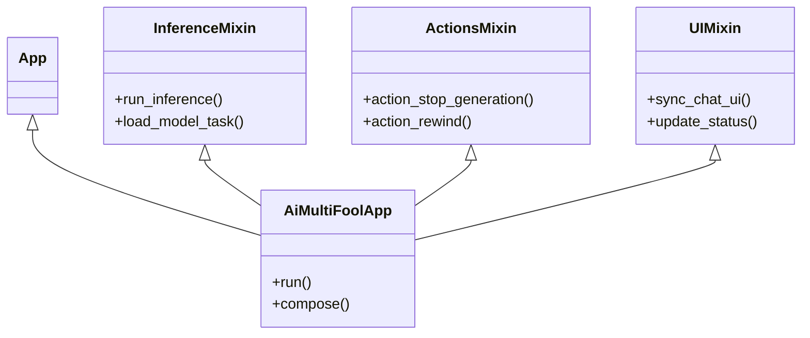

# System Reference Document: aiMultiFool v0.1.23

## 1. Executive Summary
aiMultiFool is a **hackable, modular, and privacy-centric** AI Roleplay Sandbox. It leverages **Textual** for a responsive, desktop-class TUI and **llama-cpp-python** for high-performance local inference. The architecture prioritizes separation of concerns via a Mixin pattern, enabling clean extensibility for theming, encryption, and complex character logic.

---

## 2. Technical Stack
| Component | Technology | Purpose |
| :--- | :--- | :--- |
| **Language** | Python 3.12+ | Core logic and type safety |
| **GUI Framework** | Textual | Reactive TUI with CSS styling |
| **Inference Engine** | llama-cpp-python | Python bindings for GGUF model execution |
| **Cryptography** | cryptography (Hazmat) | AES-256-GCM + Argon2id for file security |
| **Vector DB** | Qdrant (Local) | Persistent long-term memory via embeddings |
| **Concurrency** | asyncio + Threads (Linux) / Subprocess (Windows) | Non-blocking UI input during blocking inference |
| **Data Format** | JSON / PNG (Chunked) | Metadata storage for Settings and Character Cards |

---

## 3. System Architecture
The application uses a **Mixin-based monolithic architecture** orchestrated by the main `App` class.

### 3.1 Class Hierarchy


### 3.2 Core Modules
- **`aimultifool.py`**: The entry point. Initializes the `App`, loads settings, and composes the primary layout. Sets Windows event loop policy for threading compatibility.
- **`logic_mixins.py` (`InferenceMixin`, `ActionsMixin`, `VectorMixin`)**:
    - **Inference**: On Linux, uses `@work(thread=True)` to offload blocking Llama.cpp calls to a background thread. On Windows, uses subprocess-based architecture (`SubprocessLlama`) to prevent GIL-related UI freezes. Uses `call_from_thread` (Linux) or direct updates (Windows subprocess) to push updates back to the main event loop.
    - **State**: Manages the message history list, pruning logic, and token counting.
    - **Vector Chat**: On Windows, embeddings run in a separate subprocess (`SubprocessEmbedder`) to maintain UI responsiveness.
- **`ui_mixin.py` (`UIMixin`)**: Centralizes DOM manipulation. Handles the mounting of `MessageWidget`s and synchronizing the specific visual state with the backend `messages` list.
- **`styles.tcss`**: The primary stylesheet. Supports dynamic runtime modification (see **3.3 Theming**) via generic CSS variable overrides or string replacement.
- **`llm_subprocess_worker.py`**: Windows-only subprocess worker that loads llama-cpp-python models and handles inference/embedding requests. Communicates via JSONL protocol over stdin/stdout. Prevents GIL-related UI freezes by isolating blocking operations in a separate process.
- **`llm_subprocess_client.py`**: Windows-only client wrapper providing a `llama_cpp.Llama`-compatible API over the subprocess protocol. Handles process lifecycle, JSONL communication, and stream management. Automatically manages subprocess startup/shutdown and protocol synchronization.
- **`ai_engine.py`**: Model discovery, token counting utilities, and context pruning logic. Handles both native `llama_cpp.Llama` and `SubprocessLlama` instances for token counting.

### 3.3 Styling & Theming
The application uses Textual's CSS system with theme variables (`$primary`, `$accent`, `$background`, `$surface`, `$text`, `$text-muted`, `$boost`) for consistent styling across the interface.

**Theme System**:
- **Built-in Themes**: The application supports 11 built-in Textual themes accessible via the Misc/About screen.
- **Theme Selection**: Users can select a theme from the dropdown menu, which is saved to `settings.json` and persists across restarts.
- **Default Theme**: If no theme is specified in settings, the app defaults to "textual-dark".
- **Theme Application**: Themes are applied at app startup and affect all UI components including buttons, inputs, modals, and message widgets.
- **Theme Variables**: All CSS styling uses theme variables rather than hardcoded colors, ensuring full theme compatibility.

---

## 4. AI & Inference Pipeline

### 4.1 Token Streaming
- **Iterative Decoding**: The `Llama.create_chat_completion` method is called with `stream=True`.
- **Text Assembly**: Chunks are yielded back to the main thread in real-time.
- **Visual Updates**: The `UIMixin` appends text to the active `MessageWidget` on every token, calculating TPS (Tokens Per Second) on the fly.
- **Windows Subprocess Streaming**: On Windows, streaming tokens are received via JSONL protocol from the subprocess worker, maintaining the same real-time update behavior as Linux.

### 4.2 Context Management
- **Smart Pruning**: Before generation, the prompt is evaluated. If `total_tokens > 85% of context_size`, the system prunes messages from the middle of the conversation history, preserving:
    1. The System Prompt (Index 0) - Always preserved
    2. The first 3 exchanges (3 user prompts + 3 AI replies, indices 1-6) - Always preserved to maintain early roleplay context
    3. The last message - Always preserved to maintain conversation flow
- **Pruning Strategy**: Messages are deleted one by one from index 7 (right after the preserved section) until the token count reaches 60% of context_size or below. This simple approach ensures early scene setup and character introductions remain intact while maintaining recent conversation flow. The chat window UI is automatically rebuilt to match the pruned context window exactly.
- **Caching**: The system caches successful GPU layer configurations in `model_cache.json` to speed up subsequent loads of the same model.

### 4.3 Character Cards (V2 Spec)
- **Format**: SillyTavern-compatible PNGs.
- **Metadata**: Embedded in standard `tEXt` chunks or base64-encoded `zTXt` chunks.
- **AI Editor**: The app can pipe extracted metadata back into a small LLM to "rewrite" or "enhance" the character description, streaming the result into the metadata editor fields in real-time.
- **Character Management**: Full character card browser with search, edit, and encryption support.
- **Encryption**: Character cards can be encrypted with AES-256-GCM, requiring a password to view or play.

### 4.4 Chat Management
- **Save/Load Chats**: Users can save conversation histories to JSON files with optional encryption.
- **Model Settings Persistence**: Saved chats include complete model configuration (model path, context size, GPU layers, and all sampling parameters) alongside conversation history.
- **Automatic Model Restoration**: When loading a saved chat, the app automatically restores the model settings used during that conversation and reloads the model if needed.
- **Backward Compatibility**: Old chat files (messages only) continue to work seamlessly.

### 4.5 User Actions & System Prompts
- **Action Menu System**: Right sidebar containing roleplay tools and system prompts.
- **Action Manager**: Full in-app manager with real-time search, category filtering, and CRUD operations.
- **Default Actions**: Extensive library of default actions covering scene management, character interactions, and narrative control.
- **System Prompts**: Actions can be marked as system prompts that modify the AI's behavior rather than user messages.

### 4.6 Vector Chat (RAG)
- **Persistent Memory**: Local vector databases provide long-term memory for characters, allowing them to remember facts and events beyond the context window.
- **Technology**: Uses **Qdrant** in local storage mode.
- **Privacy & Telemetry**: Qdrant telemetry is explicitly disabled via the `QDRANT__TELEMETRY_DISABLED` environment variable to ensure zero usage reporting.
- **Optional Encryption**: Vector databases support optional **AES-256-GCM** encryption. When enabled, embeddings and metadata are mathematically scrambled on disk and decrypted in-memory during search.
- **Database Management**: Users can create, duplicate, rename, and delete vector databases. The system handles lifecycle management to ensure clean file handles.
- **Similarity Search**: Performs real-time similarity searches against active databases to retrieve relevant context for the current conversation.

---

## 5. User Interface & Modals

### 5.1 Main Interface Components
- **Chat Input**: Primary text input for user messages, disabled during model loading or generation.
- **Chat Scroll Area**: Displays conversation history with role-based styling (user messages bold, assistant messages normal).
- **Status Bar**: Shows current model name, generation status, TPS, token counts, and context usage.
- **Top Menu Bar**: Provides access to all major features via buttons.

### 5.2 Modal Screens
- **ModelScreen**: Model selection, context size, and GPU layer configuration.
- **ParametersScreen**: AI sampling parameter controls (Temperature, Top P, Top K, Repeat Penalty, Min P) with slider interfaces.
- **CharactersScreen**: Character card browser with search, load, edit, and encryption capabilities.
- **EditCharacterScreen**: Character metadata editor with AI-assisted editing and real-time streaming.
- **ActionsManagerScreen**: Full action menu management with search, filtering, and category organization.
- **AddActionScreen**: Create new actions or system prompts.
- **ChatManagerScreen**: Save and load conversation histories with optional encryption.
- **ThemeScreen**: Theme selection and speech styling options.
- **MiscScreen**: About screen with links to website, Discord, and support.
- **ContextWindowScreen**: Inspect the raw JSON context and system prompts being sent to the LLM.

### 5.3 Keyboard Shortcuts
- **Ctrl+S**: Stop AI generation
- **Ctrl+Enter**: Trigger AI "Continue"
- **Ctrl+Z**: Rewind (Undo last user/assistant interaction)
- **Ctrl+R**: Restart conversation from the beginning
- **Ctrl+Shift+W**: Clear chat history completely
- **Ctrl+Q**: Quit Application

### 5.4 Speech Styling
- **Modes**: Three speech styling options (None, Inversed, Highlight) for quoted text and dialogue in AI responses.
- **Real-time Updates**: Speech styling changes apply immediately to existing messages without requiring a restart.
- **Persistence**: Speech styling preference is saved to `settings.json`.

---

## 6. Security & Cryptography

### 5.1 Encryption Standards
- **Algorithm**: AES-256-GCM (Galois/Counter Mode). Authenticated encryption ensures data integrity.
- **Key Derivation**: Argon2id.
    - *Memory Cost*: 64MB
    - *Iterations*: 3
    - *Salt*: Random 16 bytes per file
    - *Nonce*: Random 12 bytes per encryption
- **Scope**: Applied to Saved Chat files (`.json`) and Character Card metadata.

### 5.2 Local Persistence
- **No Cloud Sync**: All data is strictly local.
- **Passphrase Handling**: Passphrases are never stored; they are used strictly for transient key derivation and then discarded from memory.

---

## 6. Functional Data Models

### 6.1 `settings.json`
```json
{
    "user_name": "User",
    "context_size": 8192,
    "gpu_layers": 33,
    "selected_model": "/path/to/model.gguf",
    "style": "descriptive",
    "temp": 0.8,
    "topp": 0.9,
    "topk": 40,
    "repeat": 1.0,
    "minp": 0.0,
    "theme": "textual-dark",
    "speech_styling": "highlight"
}
```

### 6.2 Saved Chat Format
**New Format** (v0.1.20+):
```json
{
    "messages": [
        {"role": "system", "content": "..."},
        {"role": "user", "content": "..."},
        {"role": "assistant", "content": "..."}
    ],
    "model_settings": {
        "selected_model": "/path/to/model.gguf",
        "context_size": 8192,
        "gpu_layers": 33,
        "temp": 0.8,
        "topp": 0.9,
        "topk": 40,
        "repeat": 1.0,
        "minp": 0.0
    }
}
```

**Legacy Format** (backward compatible):
```json
[
    {"role": "system", "content": "..."},
    {"role": "user", "content": "..."},
    {"role": "assistant", "content": "..."}
]
```

### 6.3 Application State
- **Reactive Properties**: Textual's `reactive` logic creates a unidirectional data flow. Changing `self.is_loading` automatically toggles button states (Stop/Continue) across the entire UI tree without manual DOM queries.
- **State Management**: The app tracks model loading state, generation state, and UI busy states to prevent race conditions and ensure proper cleanup.

### 6.4 Data Files
- **`settings.json`**: User preferences and model configuration.
- **`model_cache.json`**: Cached GPU layer configurations for faster model loading.
- **`action_menu.json`**: User-defined actions and system prompts.
- **`chats/*.json`**: Saved conversation histories (optionally encrypted).
- **`characters/*.png`**: Character card files (optionally encrypted).

---

## 7. Actions & Features

### 7.1 Core Actions
- **Stop Generation**: Gracefully stops ongoing AI generation.
- **Continue**: Triggers AI to continue from where it left off.
- **Regenerate**: Removes the last assistant message and re-runs inference with the same user prompt.
- **Rewind**: Undoes the last user/assistant exchange, restoring previous state.
- **Reset Chat**: Restarts conversation from the beginning while preserving character and style settings.
- **Wipe All**: Clears all chat history completely.

### 7.2 Model Management
- **Model Loading**: Automatic GPU layer detection with fallback strategies.
- **Model Caching**: Successful GPU layer configurations are cached for faster subsequent loads.
- **Model Switching**: Proper cleanup of old models before loading new ones to prevent CUDA errors.
- **Model Restoration**: Automatic model reloading when loading chats with different model settings.

### 7.3 Character Management
- **Character Loading**: Load SillyTavern PNG cards with automatic metadata extraction.
- **Character Editing**: Full metadata editor with AI-assisted generation and modification.
- **Character Encryption**: Encrypt character cards with password protection.
- **Character Browser**: Search and filter character cards by name.

### 7.4 Narrative Styles
- **44 Presets**: Extensive library of narrative style presets covering various tones and genres.
- **Style Application**: Styles modify the system prompt and apply immediately to active conversations.
- **Style Persistence**: Selected style is saved to settings and persists across restarts.

---


